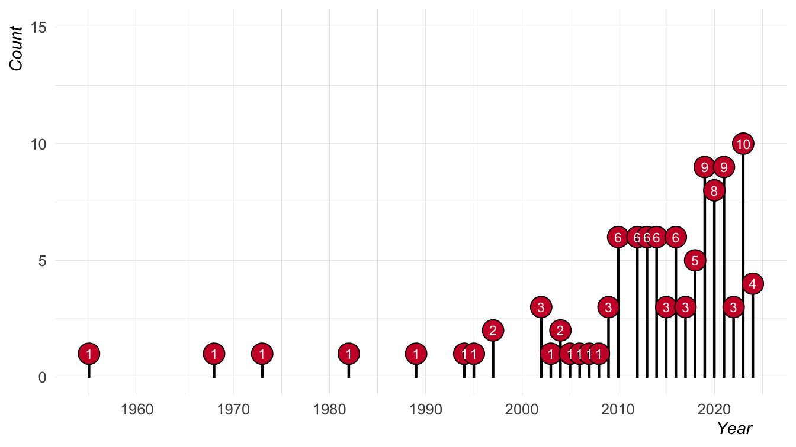

# Sound communities references
Joseph V. Casillas
2024-06-28

## Citation Types

## Journals

## Authors

## Publication Years

# Reference list

Alvord, Scott M, and B M A Rogers. 2014. “Miami-Cuban Spanish Vowels in
Contact.” *Sociolinguistic Studies* 8 (1): 139–70.
<https://doi.org/10.1558/sols.v8i1.139>.

Amengual, Mark. 2018. “Asymmetrical Interlingual Influence in the
Production of Spanish and English Laterals as a Result of Competing
Activation in Bilingual Language Processing.” *Journal of Phonetics* 69:
12–28. <https://doi.org/10.1016/j.wocn.2018.04.002>.

Antoniou, Mark, Michael D. Tyler, and Catherine T. Best. 2012. “Two Ways
to Listen: Do L2-Dominant Bilinguals Perceive Stop Voicing According to
Language Mode?” *Journal of Phonetics* 40 (4): 582–94.
<https://doi.org/10.1016/j.wocn.2012.05.005>.

Bahrick, Harry P., Lynne K. Hall, John P. Goggin, Lorraine E. Bahrick,
and Stephanie A. Berger. 1994. “Fifty Years of Language Maintenance and
Language Dominance in Bilingual Hispanic Immigrants.” *Journal of
Experimental Psychology: General* 123 (3): 264–83.
<https://doi.org/10.1037/0096-3445.123.3.264>.

Birdsong, David. 2014. “Dominance and Age in Bilingualism.” *Applied
Linguistics* 35 (4): 374–92. <https://doi.org/10.1093/applin/amu031>.

Birdsong, David, Leah M. Gertken, and Mark Amengual. 2012. “Bilingual
Language Profile: An Easy-to-Use Instrument to Assess Bilingualism.”
COERLL, University of Texas at Austin.
<https://sites.la.utexas.edu/bilingual/>.

Botvinik-Nezer, Rotem, Felix Holzmeister, Colin F Camerer, Anna Dreber,
Juergen Huber, Magnus Johannesson, Michael Kirchler, et al. 2020.
“Variability in the Analysis of a Single Neuroimaging Dataset by Many
Teams.” *Nature* 582 (7810): 84–88.
<https://doi.org/10.1038/s41586-020-2314-9>.

Brice, Alejandro E, Cecyle K Carson, and Jennifer Dennis O’Brien. 2009.
“Spanish-English Articulation and Phonology of 4-and 5-Year-Old
Preschool Children: An Initial Investigation.” *Communication Disorders
Quarterly* 31 (1): 3–14. <https://doi.org/10.1177/1525740108327447>.

Brysbaert, Marc. 2021. “Power Considerations in Bilingualism Research:
Time to Step up Our Game.” *Bilingualism: Language and Cognition* 24
(5): 813–18. <https://doi.org/10.1017/S1366728920000437>.

Bureau, U. S. Census. 2022. “The American Community Survey: 50 Years of
Personal Stories.” U.S. Department of Commerce.
<https://www.census.gov/content/dam/Census/library/publications/2022/acs/acs-50.pdf>.

Byers, Emily, and Mehmet Yavas. 2017. “Vowel Reduction in Word-Final
Position by Early and Late Spanish-English Bilinguals.” *PloS ONE* 12
(4): 1–24. <https://doi.org/10.1371/journal.pone.0175226>.

Carter, Phillip M., Lydda López Valdez, and Nandi Sims. 2020. “New
Dialect Formation Through Language Contact: Vocalic and Prosodic
Developments in Miami English.” *American Speech* 95 (2): 119–48.
<https://doi.org/10.1215/00031283-7726313>.

Casillas, Joseph V. 2021. “Interlingual Interactions Elicit Performance
Mismatches Not "Compromise" Categories in Early Bilinguals: Evidence
from Meta-Analysis and Coronal Stops.” *Languages* 6 (9): 1–20.
<https://doi.org/10.3390/languages6010009>.

Casillas, Joseph V, and Miquel Simonet. 2018. “Perceptual Categorization
and Bilingual Language Modes: Assessing the Double Phonemic Boundary in
Early and Late Bilinguals.” *Journal of Phonetics* 71: 51–64.
<https://doi.org/10.1016/j.wocn.2018.07.002>.

Christoffersen, Katherine O’Donnell. 2014. “DOES CHILD CODE-SWITCHING
DEMONSTRATE COMMUNICATIVE COMPETENCE?: A COMPARISON OF SIMULTANEOUS AND
SEQUENTIAL BILINGUALS.” *Journal of Second Language Acquisition and
Teaching: Arizona Working Papers in SLAT* 21: 20–40.

Coretta, Stefano, Joseph V Casillas, Simon Roessig, Michael Franke,
Byron Ahn, Ali H. Al-Hoorie, Jalal Al-Tamimi, et al. 2023.
“Multidimensional Signals and Analytic Flexibility: Estimating Degrees
of Freedom in Human-Speech Analyses.” *Advances in Methods and Practices
in Psychological Science* 6 (3): 1–29.
<https://doi.org/10.1177/25152459231162567>.

De Leeuw, Esther. 2019. “Native Speech Plasticity in the German-English
Late Bilingual Stefanie Graf: A Longitudinal Study over Four Decades.”
*Journal of Phonetics* 73: 24–39.
<https://doi.org/10.1016/j.wocn.2018.12.002>.

DuBord, Elise M. 2004. “Gender Assignment to English Words in the
Spanish of Southern Arizona.” PhD thesis, University of Arizona.

Dunn, Alexandra L., and Jean E. Fox Tree. 2009. “A Quick, Gradient
Bilingual Dominance Scale.” *Bilingualism: Language and Cognition* 12
(3): 273–89. <https://doi.org/10.1017/S1366728909990113>.

Ellis, Paul D. 2010. *The Essential Guide to Effect Sizes: Statistical
Power, Meta-Analysis, and the Interpretation of Research Results*.
Cambridge university press. <https://doi.org/10.1017/CBO9780511761676>.

Filipović, Luna, and John A. Hawkins. 2019. “The Complex Adaptive System
Principles Model for Bilingualism: Language Interactions Within and
Across Bilingual Minds.” *International Journal of Bilingualism* 23 (6):
1223–48. <https://doi.org/10.1177/1367006918781076>.

Flege, James E., Ian R. A. MacKay, and Thorsten Piske. 2002. “Assessing
Bilingual Dominance.” *Applied Psycholinguistics* 23 (4): 567–98.
<https://doi.org/10.1017/S0142716402004046>.

Flege, James Emil, and Robert M. Hammond. 1982. “Mimicry of
Non-Distinctive Phonetic Differences Between Language Varieties.”
*Studies in Second Language Acquisition* 5 (1): 1–17.
<https://doi.org/10.1017/S0272263100004563>.

Gelman, Andrew, and Eric Loken. 2016. “The Statistical Crisis in
Science.” *American Scientist* 102 (6): 305–18.
<https://doi.org/10.1511/2014.111.460>.

Gonzales, Kalim, and Andrew J Lotto. 2013. “A Bafri, Un Pafri:
Bilinguals’ Pseudoword Identifications Support Language-Specific
Phonetic Systems.” *Psychological Science* 24 (11): 2135–42.
<https://doi.org/10.1177/0956797613486485>.

Grosjean, François. 1989. “Neurolinguists, Beware! The Bilingual Is Not
Two Monolinguals in One Person.” *Brain and Language* 36 (1): 3–15.
<https://doi.org/10.1016/0093-934X(89)90048-5>.

———. 1997. “The Bilingual Individual.” *Interpreting* 2 (1-2): 163–87.
<https://doi.org/10.1075/intp.2.1-2.07gro>.

———. 2010. *Bilingual: Life and Reality*. Harvard university press.
<https://doi.org/10.4159/9780674056459>.

Hamann, Cornelia, Esther Rinke, and Dobrinka Genevska-Hanke. 2019.
“Editorial: Bilingual Language Development: The Role of Dominance.”
*Frontiers in Psychology* 10: 1064.
<https://doi.org/10.3389/fpsyg.2019.01064>.

Hawkins, John, and Luna Filipović. 2024. “Bilingualism-Induced Language
Change: What Can Change, When, and Why?” *Linguistics Vanguard* 10 (s2):
115–24. <https://doi.org/10.1515/lingvan-2023-0089>.

Jackson, Samantha, and Derek Denis. 2024. “What I Say, or How I Say It?
Ethnic Accents and Hiring Evaluations in the Greater Toronto Area.”
*Language* 100 (2): e27–62. <https://doi.org/10.1353/lan.2024.a929753>.

Jiang, Xiaochen, Kira Gossack-Keenan, and Marc D. Pell. 2020. “To
Believe or Not to Believe? How Voice and Accent Information in Speech
Alter Listener Impressions of Trust.” *Quarterly Journal of Experimental
Psychology* 73 (1): 55–79. <https://doi.org/10.1177/1747021819865833>.

Kartushina, Natalia, and Clara D. Martin. 2019. “Third-Language Learning
Affects Bilinguals’ Production in Both Their Native Languages: A
Longitudinal Study of Dynamic Changes in L1, L2 and L3 Vowel
Production.” *Journal of Phonetics* 77: 1–21.
<https://doi.org/10.1016/j.wocn.2019.100920>.

Kelly, Niamh. 2022. “Change Across Time in L2 Intonation Vs. Segments: A
Longitudinal Study of the English of Ole Gunnar Solskjaer.” *Languages*
7 (3): 1–17. <https://doi.org/10.3390/languages7030210>.

Kornder, Lisa, and Ineke Mennen. 2021. “Longitudinal Developments in
Bilingual Second Language Acquisition and First Language Attrition of
Speech: The Case of Arnold Schwarzenegger.” *Languages* 6 (2): 1–25.
<https://doi.org/10.3390/languages6020061>.

Kroll, Judith F, and Ellen Bialystok. 2013. “Understanding the
Consequences of Bilingualism for Language Processing and Cognition.”
*Journal of Cognitive Psychology* 25 (5): 497–514.
<https://doi.org/10.1080/20445911.2013.799170>.

Lambert, Wallace E. 1955. “Measurement of the Linguistic Dominance of
Bilinguals.” *The Journal of Abnormal and Social Psychology* 50 (2):
197–200. <https://doi.org/10.1037/h0042120>.

Lev-Ari, Shiri, and Boaz Keysar. 2010. “Why Don’t We Believe Non-Native
Speakers? The Influence of Accent on Credibility.” *Journal of
Experimental Social Psychology* 46 (6): 1093–96.
<https://doi.org/10.1016/j.jesp.2010.05.025>.

Li, Ping, Sara Sepanski, and Xiaowei Zhao. 2006. “Language History
Questionnaire: A Web-Based Interface for Bilingual Research.” *Behavior
Research Methods* 38 (2): 202–10. <https://doi.org/10.3758/BF03192770>.

Lim, Valerie P. C., Susan J. Rickard Liow, Michelle Lincoln, Yiong Huak
Chan, and Mark Onslow. 2008. “Determining Language Dominance in
English-Mandarin Bilinguals: Development of a Self-Report Classification
Tool for Clinical Use.” *Applied Psycholinguistics* 29 (3): 389–412.
<https://doi.org/10.1017/S0142716408080181>.

Lozano-Argüelles, Cristina, Laura Fernández Arroyo, Nicole Rodrı́guez,
Ezequiel M Durand López, Juan J Garrido Pozú, Jennifer Markovits,
Jessica P Varela, Núria de Rocafiguera, and Joseph V Casillas. 2021.
“Conceptually Cued Perceptual Categorization in Adult L2 Learners.”
*Studies in Second Language Acquisition* 43 (1): 204–19.
<https://doi.org/10.1017/S0272263120000273>.

Luk, Gigi, and Ellen Bialystok. 2013. “Bilingualism Is Not a Categorical
Variable: Interaction Between Language Proficiency and Usage.” *Journal
of Cognitive Psychology* 25 (5): 605–21.
<https://doi.org/10.1080/20445911.2013.795574>.

Lynn, Klonda. 2023. “A Phonetic Analysis of the English Spoken by
Mexican Children in the Elementary Schools of Arizona.” PhD thesis,
Louisiana State University; Agricultural & Mechanical College.

Marian, Viorica, Henrike K. Blumenfeld, and Margarita Kaushanskaya.
2007. “The Language Experience and Proficiency Questionnaire (LEAP-Q):
Assessing Language Profiles in Bilinguals and Multilinguals.” *Journal
of Speech, Language, and Hearing Research* 50 (4): 940–67.
<https://doi.org/10.1044/1092-4388(2007/067)>.

Mendoza-Denton, Norma. 2014. *Homegirls: Language and Cultural Practice
Among Latina Youth Gangs*. John Wiley & Sons.
<https://doi.org/10.1002/9780470693728>.

Peña, Elizabeth D., Ronald B. Gillam, and Lisa M. Bedore. 2014. “Dynamic
Assessment of Narrative Ability in English Accurately Identifies
Language Impairment in English Language Learners.” *Journal of Speech,
Language, and Hearing Research* 57 (6): 2208–20.
<https://doi.org/10.1044/2014_JSLHR-L-13-0151>.

Potowski, Kim. 2012. “Identity and Heritage Learners: Moving Beyond
Essentializations.” In *Spanish as a Heritage Language in the United
States: The State of the Field*, edited by Sara M. Beaudrie and Marta
Fairclough, 179–202. Washington, DC: Georgetown University Press.

Potowski, Kim, and Lourdes Torres. 2023. *Spanish in Chicago*. Oxford
University Press.

Reed, Peter E. 2020. “Place and Language: Links Between Speech, Region,
and Connection to Place.” *Wiley Interdisciplinary Reviews: Cognitive
Science* 11 (3): 1–11. <https://doi.org/10.1002/wcs.1524>.

Rodríguez-Guerra, Míriam, Sonia Colina, and Leah Fabiano-Smith. 2023.
“Interaction in Bilingual Early Speech Acquisition: Acceleration in the
Bilingual Acquisition of English Liquids for English-Spanish
Bilinguals.” *Lingua* 281: 1–21.
<https://doi.org/10.1016/j.lingua.2022.103438>.

Roettger, Timo B. 2019. “Researcher Degrees of Freedom in Phonetic
Research.” *Laboratory Phonology* 10 (1): 1–27.
<https://doi.org/10.5334/labphon.147>.

Sankoff, Gillian. 2002. “Linguistic Outcomes of Language Contact.” In
*The Handbook of Language Variation and Change*, edited by Jack K.
Chambers, Peter Trudgill, and Natalie Schilling-Estes, 1:638–68. Malden,
MA: Blackwell. <https://doi.org/10.1002/9781118335598>.

Sonderegger, Morgan, Jane Stuart-Smith, Thea Knowles, Rachel Macdonald,
and Tamara Rathcke. 2020. “Structured Heterogeneity in Scottish Stops
over the Twentieth Century.” *Language* 96 (1): 94–125.
<https://doi.org/10.1353/lan.2020.0003>.

Stuart-Smith, Jane, Morgan Sonderegger, Tamara Rathcke, and Rachel
Macdonald. 2015. “The Private Life of Stops: VOT in a Real-Time Corpus
of Spontaneous Glaswegian.” *Laboratory Phonology* 6 (3-4): 505–49.
<https://doi.org/10.1515/lp-2015-0015>.

Tomé Lourido, Gisela, and Bronwen Evans. 2019. “The Effects of Language
Dominance Switch in Bilinguals: Galician New Speakers’ Speech Production
and Perception.” *Bilingualism: Language and Cognition* 22 (3): 637–54.
<https://doi.org/10.1017/S1366728918000603>.

Treffers-Daller, Jeanine, and Carmen Silva-Corvalán. 2016. *Language
Dominance in Bilinguals: Issues of Measurement and Operationalization*.
Cambridge, UK: Cambridge University Press.
<https://doi.org/10.1017/CBO9781107375345>.

Weinreich, Uriel. 1968. *Languages in Contact: Findings and Problems*.
The Hague: Mouton de Gruyter.
https://doi.org/<https://doi.org/10.1515/9783110802177>.

Wolfram, Walt, Phillip Carter, and Brenda Moriello. 2004. “Emerging
Hispanic English: New Dialect Formation in the American South.” *Journal
of Sociolinguistics* 8 (3): 339–58.
<https://doi.org/10.1111/j.1467-9841.2004.00264.x>.

Yao, Yao, and Charles B Chang. 2016. “On the Cognitive Basis of
Contact-Induced Sound Change: Vowel Merger Reversal in Shanghainese.”
*Language* 92 (2): 433–67. <https://doi.org/10.1353/lan.2016.0031>.

