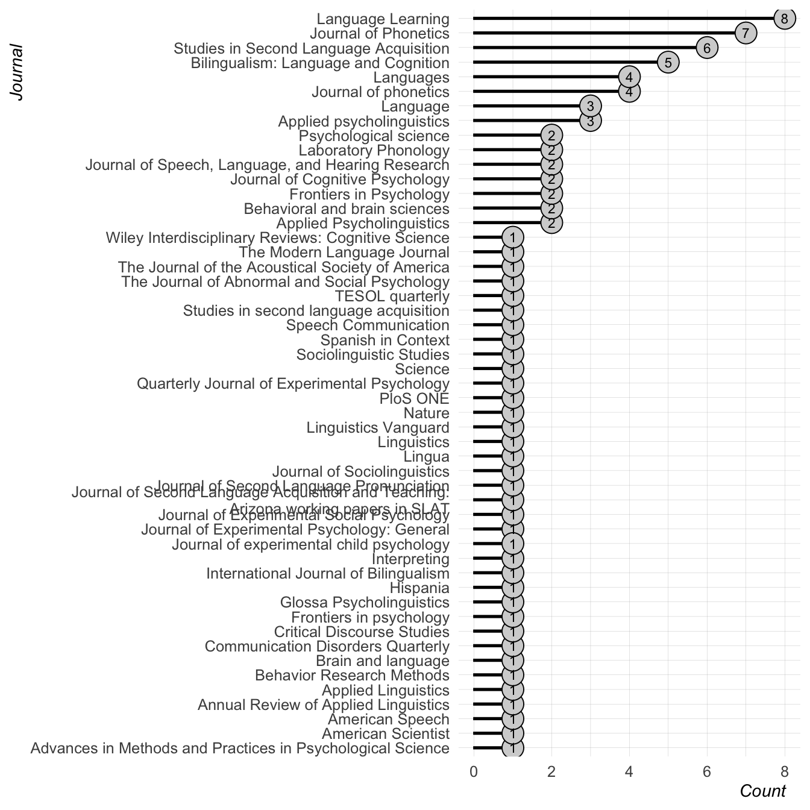

# Sound communities references
Joseph V. Casillas
2024-03-01

## Citation Types

## Journals

## Authors

## Publication Years

# Reference list

Amengual, Mark. 2018. “Asymmetrical Interlingual Influence in the
Production of Spanish and English Laterals as a Result of Competing
Activation in Bilingual Language Processing.” *Journal of Phonetics* 69:
12–28. <https://doi.org/10.1016/j.wocn.2018.04.002>.

Barr, Dale J, Roger Levy, Christoph Scheepers, and Harry J Tily. 2013.
“Random Effects Structure for Confirmatory Hypothesis Testing: Keep It
Maximal.” *Journal of Memory and Language* 68 (3): 255–78.
<https://doi.org/10.1016/j.jml.2012.11.001>.

Bastiaansen, Jojanneke A, Yoram K Kunkels, Frank J Blaauw, Steven M
Boker, Eva Ceulemans, Meng Chen, Sy-Miin Chow, et al. 2020. “Time to Get
Personal? The Impact of Researchers Choices on the Selection of
Treatment Targets Using the Experience Sampling Methodology.” *Journal
of Psychosomatic Research* 137: 1–14.
<https://doi.org/10.1016/j.jpsychores.2020.110211>.

Birdsong, David. 2014. “Dominance and Age in Bilingualism.” *Applied
Linguistics* 35 (4): 374–92. <https://doi.org/10.1093/applin/amu031>.

Bochynska, Agata, Liam Keeble, Caitlin Halfacre, Joseph V Casillas,
Irys-Amélie Champagne, Kaidi Chen, Melanie Röthlisberger, Erin M
Buchanan, and Timo Roettger. 2023. “Reproducible Research Practices and
Transparency Across Linguistics.” *Glossa Psycholinguistics* 2 (1):
1–36. <https://doi.org/10.5070/G6011239>.

Botvinik-Nezer, Rotem, Felix Holzmeister, Colin F Camerer, Anna Dreber,
Juergen Huber, Magnus Johannesson, Michael Kirchler, et al. 2020.
“Variability in the Analysis of a Single Neuroimaging Dataset by Many
Teams.” *Nature* 582 (7810): 84–88.
<https://doi.org/10.1038/s41586-020-2314-9>.

Breznau, Nate, Eike Mark Rinke, Alexander Wuttke, Hung HV Nguyen, Muna
Adem, Jule Adriaans, Amalia Alvarez-Benjumea, et al. 2022. “Observing
Many Researchers Using the Same Data and Hypothesis Reveals a Hidden
Universe of Uncertainty.” *Proceedings of the National Academy of
Sciences* 119 (44): 1–8. <https://doi.org/10.1073/pnas.2203150119>.

Brysbaert, Marc. 2021. “Power Considerations in Bilingualism Research:
Time to Step up Our Game.” *Bilingualism: Language and Cognition* 24
(5): 813–18. <https://doi.org/10.1017/S1366728920000437>.

Casillas, Joseph V. 2021. “Interlingual Interactions Elicit Performance
Mismatches Not "Compromise" Categories in Early Bilinguals: Evidence
from Meta-Analysis and Coronal Stops.” *Languages* 6 (9): 1–20.
<https://doi.org/10.3390/languages6010009>.

Casillas, Joseph V, and Miquel Simonet. 2018. “Perceptual Categorization
and Bilingual Language Modes: Assessing the Double Phonemic Boundary in
Early and Late Bilinguals.” *Journal of Phonetics* 71: 51–64.
<https://doi.org/10.1016/j.wocn.2018.07.002>.

Coretta, Stefano, Joseph V Casillas, Simon Roessig, Michael Franke,
Byron Ahn, Ali H. Al-Hoorie, Jalal Al-Tamimi, et al. 2023.
“Multidimensional Signals and Analytic Flexibility: Estimating Degrees
of Freedom in Human-Speech Analyses.” *Advances in Methods and Practices
in Psychological Science* 6 (3): 1–29.
<https://doi.org/10.1177/25152459231162567>.

De Leeuw, Esther. 2019. “Native Speech Plasticity in the German-English
Late Bilingual Stefanie Graf: A Longitudinal Study over Four Decades.”
*Journal of Phonetics* 73: 24–39.
<https://doi.org/10.1016/j.wocn.2018.12.002>.

Gelman, Andrew, and Eric Loken. 2016. “The Statistical Crisis in
Science.” *American Scientist* 102 (6): 305–18.
<https://doi.org/10.1511/2014.111.460>.

Grosjean, François. 2010. *Bilingual: Life and Reality*. Harvard
university press. <https://doi.org/10.4159/9780674056459>.

Kelly, Niamh. 2022. “Change Across Time in L2 Intonation Vs. Segments: A
Longitudinal Study of the English of Ole Gunnar Solskjaer.” *Languages*
7 (3): 210. <https://doi.org/10.3390/languages7030210>.

Kornder, Lisa, and Ineke Mennen. 2021. “Longitudinal Developments in
Bilingual Second Language Acquisition and First Language Attrition of
Speech: The Case of Arnold Schwarzenegger.” *Languages* 6 (2): 61.
<https://doi.org/10.3390/languages6020061>.

Lozano-Argüelles, Cristina, Laura Fernández Arroyo, Nicole Rodrı́guez,
Ezequiel M Durand López, Juan J Garrido Pozú, Jennifer Markovits,
Jessica P Varela, Núria de Rocafiguera, and Joseph V Casillas. 2021.
“Conceptually Cued Perceptual Categorization in Adult L2 Learners.”
*Studies in Second Language Acquisition* 43 (1): 204–19.
<https://doi.org/10.1017/S0272263120000273>.

Mohamed, Miski A, and Matthew B Winn. 2023. “Acoustical Analysis of
Taylor Swift’s Speech and Singing Throughout Her Career.” *The Journal
of the Acoustical Society of America* 153 (Issue 3 supplement): A296–96.
<https://doi.org/10.1121/10.0018912>.

Plonsky, Luke, and Frederick L Oswald. 2014. “How Big Is ‘Big’?
Interpreting Effect Sizes in L2 Research.” *Language Learning* 64 (4):
878–912. <https://doi.org/10.1111/lang.12079>.

Roettger, Timo B. 2019. “Researcher Degrees of Freedom in Phonetic
Research.” *Laboratory Phonology* 10 (1): 1–27.
<https://doi.org/10.5334/labphon.147>.

Simmons, Joseph P, Leif D Nelson, and Uri Simonsohn. 2011.
“False-Positive Psychology: Undisclosed Flexibility in Data Collection
and Analysis Allows Presenting Anything as Significant.” *Psychological
Science* 22 (11): 1359–66. <https://doi.org/10.1177/0956797611417632>.

